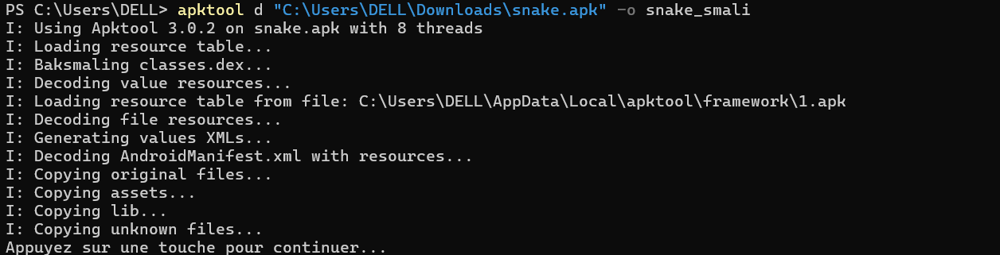
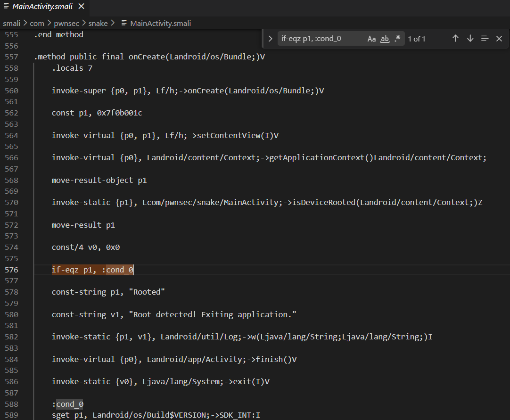
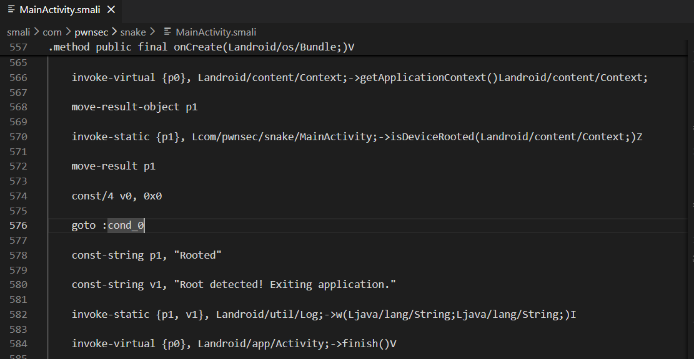
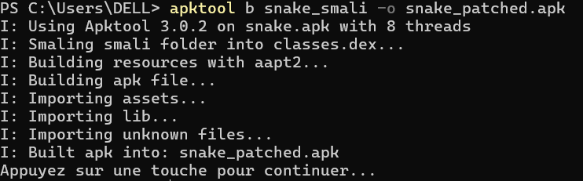
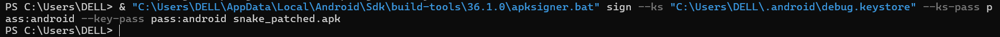
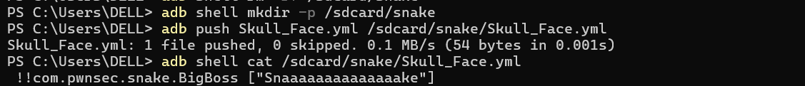

# Exploitation Report: Snake Android Challenge

Ce lab documente la méthodologie complète pour bypasser les protections anti-reverse d'une application Android et exploiter une vulnérabilité de désérialisation **SnakeYAML (CVE-2022-1471)** afin de récupérer un flag protégé.

---

## Environnement et Outils
*   **Analyse Statique :** Jadx-GUI
*   **Ingénierie Inverse :** Apktool
*   **Signature :** Apksigner (Android SDK)
*   **Exploitation :** ADB (Android Debug Bridge)

---

## Étapes d'Exécution

### 1. Analyse et Décompilation
L'analyse initiale via Jadx-GUI a révélé des mécanismes de détection de root et d'émulateur empêchant l'exécution du code vulnérable. Nous utilisons **apktool** pour décompiler l'APK et accéder aux fichiers Smali.

### 2. Patching Smali (Bypass Anti-Root)
Dans le fichier `MainActivity.smali`, nous identifions la logique de détection de root. L'application utilise `isDeviceRooted` pour décider d'appeler `System->exit()`.

*   **Code Original :** Utilise une condition `if-eqz` pour vérifier le statut de root.

*   **Modification :** Nous forçons le flux d'exécution en remplaçant la condition par un `goto :cond_0`, neutralisant ainsi l'arrêt forcé de l'application.

### 3. Recompilation et Signature
Après modification, l'APK est re-packagé. Une signature numérique est impérative pour permettre l'installation sur l'appareil cible.

*   **Re-build :**

*   **Signature via apksigner :**

### 4. Injection du Payload YAML
L'application vulnérable parse un fichier `Skull_Face.yml` situé dans `/sdcard/snake/`. Nous exploitons la **CVE-2022-1471** pour instancier la classe `BigBoss` via un tag YAML spécifique.

*   **Création du Payload :** Utilisation de `printf` pour garantir l'absence de caractères parasites (BOM).

*   **Transfert et Vérification :** Le fichier est poussé sur l'appareil via `adb push`.

### 5. Déclenchement de l'Intent et Récupération du Flag
L'exploitation finale nécessite l'envoi d'un Intent spécifique (`SNAKE: BigBoss`) pour déclencher la lecture du YAML. Le flag est ensuite extrait des logs système (Logcat).

*   **Commande :** `adb shell am start -n com.pwnsec.snake/.MainActivity -e SNAKE BigBoss`
*   **Résultat :**

---

## Flag Final
`PWNSEC{W3'r3_N0t_T00l5_0f_The_g0v3rnm3n7_0R_4ny0n3_3ls3}`

---